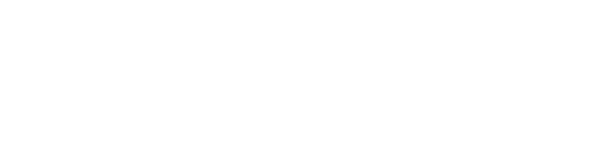
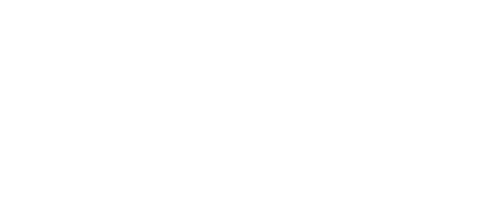

# SimpleRA

_A laughably-minimalist, integer-only, read-only Relational Database Management System that makes the author question why they ever bothered to write it up!_  
  

## _Data Systems, Monsoon 2020_

19th August, 2020
Wednesday

---

### Important Features

- Relational Algebra Operators
- Integers Only
- No update operations
- No aggregate operations
- No nested queries
- No transaction management
- Single thread programming only
- No identifiers should have spaces in them


---

### Commands

There are 2 kinds of commands in this database.

- Assignment statements
- Non-assignment statements

_Note: Not all operators have been implemented, some have been omitted for you to implement in later phases_

---

## Non Assignment Statements

Non-assginment statements do not create a new table (except load which just loads an existing table) in the process

- LOAD
- LIST
- PRINT
- RENAME
- EXPORT
- CLEAR
- QUIT

---

## Non Assignment Statements

The following haven't been implemented
- INDEX

---

### LOAD

Syntax:
```
LOAD <table_name>
```
- To successfully load a table, there should be a csv file names <table_name>.csv consisiting of comma-seperated integers in the data folder
- None of the columns in the data file should have the same name
- every cell in the table should have a value

Run: `LOAD A`

---

### LIST TABLES

Syntax
```
LIST TABLES
```
This command lists all tables that have been loaded or created using assignment statements

Run: `LIST TABLES`
Run: `LOAD B`, `LIST TABLES`

---

### PRINT

Syntax
```
PRINT <table_name>
```

- Displays the first PRINT_COUNT (global variable) rows of the table. 
- Less number of rows can be printed if the table has only a few rows

Run: `PRINT B`

---

### RENAME

Syntax
```
RENAME <toColumnName> TO <fromColumnName> FROM <table_name>
```

- Naturally <table_name> should be a loaded table in the system and <fromColumnName> should be an exsiting column in the table
- <toColumnName> should not be another column in the table

Run: `RENAME b TO c FROM B`

---

### EXPORT

Syntax
```
EXPORT <table_name>
```

- All changes made and new tables created, exist only within the system and will be deleted once execution ends (temp file)
- To keep changes made (RENAME and new tables), you have to export the table (data)

Run: `EXPORT B`

---

### CLEAR

Syntax
```
CLEAR <table_name>
```
- Removes table from system
- The table has to have previously existed in the system to remove it
- If you want to keep any of the changes you've made to an old table or want to keep the new table, make sure to export !

Run: `CLEAR B`

---

### QUIT

Syntax
```
QUIT
```

- Clear all tables present in the system (**_WITHOUT EXPORTING THEM_**)  (temp file - empty)

Run: `QUIT`

---

### INDEX*

Syntax:
```
INDEX ON <columnName> FROM <table_name> USING <indexing_strategy>
```

Where <indexing_strategy> could be 
- `BTREE` - BTree indexing on column
- `HASH` - Index via a hashmap
- `NOTHING` - Removes index if present 

---
### Questions ?

---

## Assignment Statements

- All assignment statements lead to the creation of a new table. 

- Every statement is of the form ```<new_table_name> <- <assignment_statement>``` 

- Naturally in all cases, <new_table_name> shouldn't already exist in the system

---

## Assignment Statements

- CROSS
- PROJECTION
- SELECTION

The following haven't been implemented
- DISTINCT
- JOIN
- SORT

---

### CROSS

Syntax
```
<new_table_name> <- CROSS <table_name1> <table_name2>
```

- Both the tables being crossed should exist in the system
- If there are columns with the same names in the two tables, the columns are indexed with the table name. If both tables being crossed are the same, table names are indexed with '1' and '2'

Run: `cross_AA <- CROSS A A`

`A(A, B) x A(A, B) -> cross_AA(A1_A, A1_B, A2_A, A2_B)`

---

### SELECTION

Syntax
```
<new_table_name> <- SELECT <condition> FROM <table_name>
```

Where <condition> is of either form
```
<first_column_name> <bin_op> <second_column_name>
<first_column_name> <bin_op> <int_literal>
```

Where <bin_op> can be any operator among {>, <, >=, <=, =>, =<, ==, !=}

---

- The selection command only takes one condition at a time

Run: `R <- SELECT a >= 1 FROM A`
`S <- SELECT a > b FROM A`

---

### PROJECTION

Syntax
```
<new_table_name> <- PROJECT <column1>(,<columnN>)* FROM <table_name>
```

- naturally all columns should be present in the original table

Run: `C <- PROJECT c FROM A`

---

### DISTINCT*

Syntax
```
<new_table_name> <- DISTINCT <table_name>
```

- naturally table should exist

Exmample: `D <- DISTINCT A`

---

### JOIN*

Syntax
```
<new_relation_name> <- JOIN <table1>, <table2> ON <column1> <bin_op> <column2>
```

Where <bin_op> means the same as it does in the SELECT operator

- Implicitly assumes <column1> is from <table1> and <column2> if from <table2>

Example: `J <- JOIN A, B ON a == a`

---

### SORT*

Syntax
```
<new_table_name> <- SORT <table_name> BY <column_name> IN <sorting_order>
```

Where <sorting_order> can be `ASC` or `DESC`

Example: `S <- SORT A BY b IN ASC`

---

### SOURCE

Syntax
```
SOURCE <query_name>
```
- Special command that takes in a file script from the data directory
- file name should end in ".ra" indicating it's a query file
- File to be present in the data folder
- Used in last phase of project

---

### Internals

- Buffer Manager

- Cursors

- Tables

- Executors

---

### Command Execution Flow



Run: `LOAD A` with debugger

see: load.cpp

---

### Syntactic Parser

- Splits the query into query units

see: syntacticParser.h syntacticParser.cpp

### Semantic Parser

- Makes sure your query makes semantic sense

see: semanticParser.h semanticParser.cpp

---

### Executors

Every command(COMMAND) has a file in the executors directory, within that directory you'll find 3 functions

```
syntacticParseCOMMAND
semanticParseCOMMAND
executeCOMMAND
```

---

### Buffer Manager

- Load splits and stores the table into blocks. For this we utilise the Buffer Manager

- Buffer Manager follows a FIFO paradigm. Essentially a queue

---

### Table Catalogue

- The table catalogue is an index of tables currently loaded into the system

---

### Cursors

A cursor is an object that acts like a pointer in a table. To read from a table, you need to declare a cursor.



Run: `R <- SELECT a == 1 FROM A` with debugger

---

### Logger

Every function call is logged in file names "log"

---

## Project*

- Phase 1: Code Familiarity (to be released today/tomorrow max)
- Phase 2: 2 Phase Merge Sort
- Phase 3: Indexing
- Phase 4: Indexing Optimized Operators
- Phase 4: Optimisation (SOURCE)

_Note: may include duplicate elimination_
* Tentative

---

## Project Rules

- **Plagiarism: F**
- Not sticking to submission guidelines will lead to penalties and at times to scoring 0
- Project phases build on top of each other, failing to do one phase may hinder the rest
- If for any reason you fail to complete the project on time, please mail the Prof directly for extensions and not the TAs, the TAs have no jurisdiction in these cases

---

## Adminstrative Rules

- No informal contact with the TAs, you may post on Moodle regarding any doubts. A forum will be created for the same
- TA Hours have been updated on Moodle
- If you need to contact the TAs for matters that don't concern the whole class you may mail us here - datasystems_tas_m20@IIITAPhyd.onmicrosoft.com

---

## References

- GitHub Repo - [SimpleRA](https://github.com/SimpleRA/SimpleRA)
- Build and run instructions will be provided later


